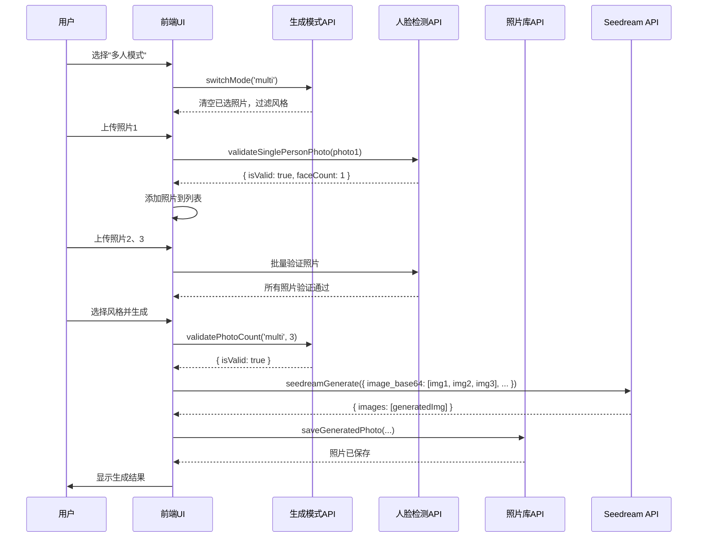
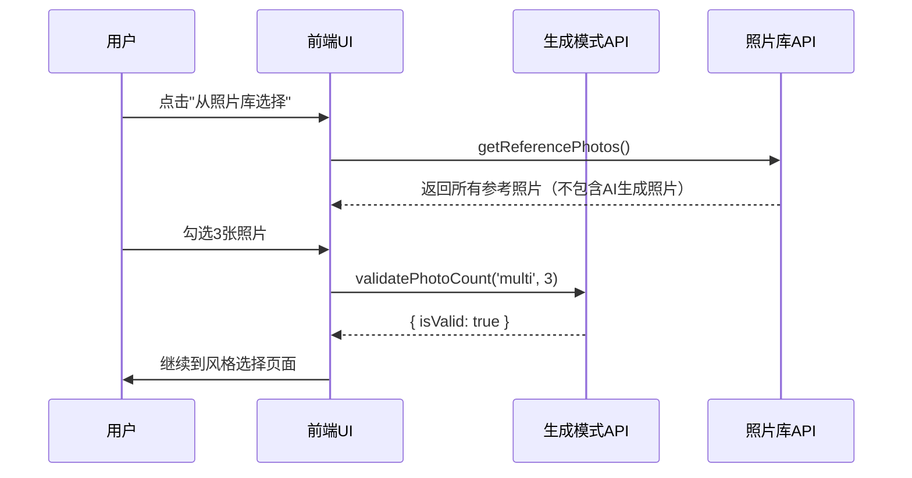
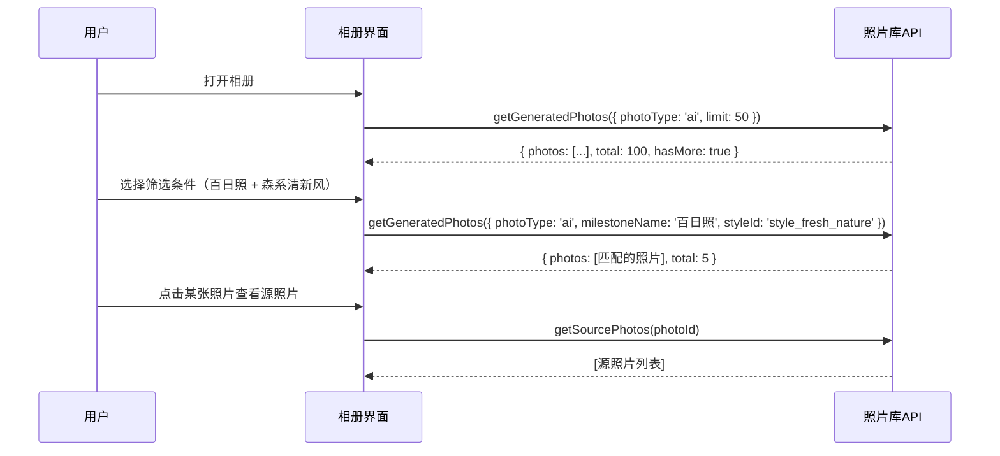

# API契约文档索引

**Feature**: 多人照片生成模式选择 (003-2)
**创建日期**: 2025-10-15
**状态**: Draft
**目的**: 为前后端开发提供明确的API接口规范

---

## 文档概览

本目录包含"多人照片生成模式选择"功能的所有API契约文档，涵盖人脸检测、模式管理、照片库查询、AI生成等核心接口。

### 文档列表

| 文档 | 功能模块 | 说明 |
|------|---------|------|
| [photo-validation-api.md](./photo-validation-api.md) | 人脸检测与照片验证 | 使用 face-api.js 在客户端本地检测照片中的人脸数量，验证单人照片 |
| [generation-mode-api.md](./generation-mode-api.md) | 生成模式管理 | 管理单人/多人模式切换、照片数量验证、风格过滤 |
| [photo-library-api.md](./photo-library-api.md) | 照片库查询 | 查询参考照片库和生成照片相册，支持多维度筛选 |
| [seedream-multi-person-api.md](./seedream-multi-person-api.md) | Seedream多人照片生成 | 调用 Seedream 4.0 API 生成单人/多人照片 |

---

## 核心API流程

### 流程1: 多人照片生成完整流程



### 流程2: 参考照片库选择流程



### 流程3: 生成照片相册筛选流程



---

## API依赖关系

```
┌──────────────────────────────────────────┐
│         用户界面（React组件）              │
└──────────────────────────────────────────┘
           ↓
┌──────────────────────────────────────────┐
│         Zustand状态管理                    │
│  - generationMode                         │
│  - uploadedPhotos                         │
│  - photoValidationResults                 │
│  - filteredStyleIds                       │
└──────────────────────────────────────────┘
           ↓
┌──────────────────────────────────────────┐
│         应用层API（TypeScript）            │
│                                           │
│  ┌─────────────────────────────────────┐ │
│  │ 生成模式API                           │ │
│  │ - getGenerationModeConfig()          │ │
│  │ - switchGenerationMode()             │ │
│  │ - validatePhotoCount()               │ │
│  │ - filterStylesByMode()               │ │
│  └─────────────────────────────────────┘ │
│                                           │
│  ┌─────────────────────────────────────┐ │
│  │ 人脸检测API                           │ │
│  │ - validateSinglePersonPhoto()        │ │
│  └─────────────────────────────────────┘ │
│                                           │
│  ┌─────────────────────────────────────┐ │
│  │ 照片库API                             │ │
│  │ - getReferencePhotos()               │ │
│  │ - getGeneratedPhotos()               │ │
│  │ - getSourcePhotos()                  │ │
│  └─────────────────────────────────────┘ │
└──────────────────────────────────────────┘
           ↓                    ↓
┌──────────────────┐  ┌──────────────────┐
│   face-api.js    │  │  SQLite数据库     │
│ (客户端人脸检测)  │  │ (library_photos) │
└──────────────────┘  └──────────────────┘
           ↓
┌──────────────────────────────────────────┐
│         Tauri后端命令（Rust）              │
│                                           │
│  ┌─────────────────────────────────────┐ │
│  │ seedream_generate                    │ │
│  │ - HTTP请求到Seedream API             │ │
│  │ - API密钥安全存储                     │ │
│  └─────────────────────────────────────┘ │
└──────────────────────────────────────────┘
           ↓
┌──────────────────────────────────────────┐
│      Seedream 4.0 API（外部服务）          │
│      https://ark.cn-beijing.volces.com   │
└──────────────────────────────────────────┘
```

---

## 技术栈与依赖

### 前端

| 技术 | 版本 | 用途 |
|------|------|------|
| React | 18.x | UI框架 |
| TypeScript | 5.x | 类型系统 |
| Zustand | 4.x | 状态管理 |
| face-api.js | 0.22.x | 客户端人脸检测 |
| Tauri | 2.x | 跨平台桌面应用框架 |

### 后端

| 技术 | 版本 | 用途 |
|------|------|------|
| Rust | 1.70+ | Tauri后端语言 |
| SQLite | 3.38+ | 本地数据库（支持JSON索引） |
| reqwest | 0.11.x | HTTP客户端（调用Seedream API） |

### 外部服务

| 服务 | 用途 | 定价 |
|------|------|------|
| Seedream 4.0 | AI图像生成 | ~$0.05/张（2K尺寸） |

---

## 数据模型概览

### 核心表结构

#### library_photos（照片表）

```sql
CREATE TABLE library_photos (
  id TEXT PRIMARY KEY,
  file_path TEXT NOT NULL,
  uploaded_at INTEGER NOT NULL,
  is_ai_generated INTEGER NOT NULL DEFAULT 0,  -- 0=参考照片, 1=AI生成
  ai_metadata TEXT,                             -- AI元数据JSON
  person_id TEXT,
  person_name TEXT,
  face_count INTEGER DEFAULT 0,                -- 人脸数量
  face_confidence REAL,                        -- 人脸检测置信度
  quality_score REAL,                          -- 综合质量评分
  -- 其他字段省略...
);
```

#### generation_tasks（生成任务表）

```sql
CREATE TABLE generation_tasks (
  id TEXT PRIMARY KEY,
  created_at INTEGER NOT NULL,
  mode TEXT NOT NULL DEFAULT 'single',  -- single/multi
  photo_ids TEXT NOT NULL,               -- JSON数组
  selected_style_ids TEXT NOT NULL,      -- JSON数组
  status TEXT NOT NULL,                  -- pending/generating/success/failed
  -- 其他字段省略...
);
```

#### style_templates（风格模板表）

```sql
CREATE TABLE style_templates (
  id TEXT PRIMARY KEY,
  name TEXT NOT NULL,
  prompt_template TEXT NOT NULL,
  supported_modes TEXT NOT NULL DEFAULT '["single"]',  -- JSON数组
  min_photos INTEGER NOT NULL DEFAULT 1,
  max_photos INTEGER NOT NULL DEFAULT 1,
  is_multi_person INTEGER NOT NULL DEFAULT 0,
  -- 其他字段省略...
);
```

### 关键索引

```sql
-- 照片类型+时间复合索引
CREATE INDEX idx_library_photos_ai_type_time
ON library_photos(is_ai_generated, uploaded_at DESC);

-- JSON字段索引（风格ID）
CREATE INDEX idx_library_photos_style
ON library_photos(json_extract(ai_metadata, '$.styleId'));

-- JSON字段索引（里程碑名称）
CREATE INDEX idx_library_photos_milestone
ON library_photos(json_extract(ai_metadata, '$.milestoneName'));
```

---

## 开发指南

### 1. 前端开发

**创建新组件时的API调用示例**

```typescript
import { useAppStore } from '@/lib/store'
import { validateSinglePersonPhoto } from '@/lib/face-detection'
import { getGenerationModeConfig } from '@/lib/generation-mode'

function PhotoUploadComponent() {
  const { generationMode, addPhoto } = useAppStore()
  const config = getGenerationModeConfig(generationMode)

  async function handleUpload(file: File) {
    // 1. 保存文件到本地
    const photo = await savePhotoToLocal(file)

    // 2. 人脸检测（如果需要）
    if (config.requiresFaceDetection) {
      const validation = await validateSinglePersonPhoto(photo.filePath)
      if (!validation.isValid) {
        alert(validation.error)
        return
      }
    }

    // 3. 添加到状态
    await addPhoto(photo)
  }

  return <input type="file" onChange={e => handleUpload(e.target.files[0])} />
}
```

### 2. 后端开发

**Rust命令实现参考**

```rust
// src-tauri/src/commands/seedream.rs
#[tauri::command]
pub async fn seedream_generate(
    payload: SeedreamGeneratePayload
) -> Result<SeedreamGenerateResponse, String> {
    // 实现HTTP请求到Seedream API
    // 参考 seedream-multi-person-api.md 的完整实现
}
```

### 3. 数据库迁移

**执行迁移脚本**

```typescript
// src/lib/database.ts
async function migrateToV2(db: Database) {
  // 添加新字段
  await db.execute('ALTER TABLE library_photos ADD COLUMN face_count INTEGER DEFAULT 0')
  await db.execute('ALTER TABLE generation_tasks ADD COLUMN mode TEXT NOT NULL DEFAULT "single"')

  // 创建索引
  await db.execute(`
    CREATE INDEX IF NOT EXISTS idx_library_photos_ai_type_time
    ON library_photos(is_ai_generated, uploaded_at DESC)
  `)

  console.log('数据库迁移到v2.0完成')
}
```

---

## 测试建议

### 单元测试

- **人脸检测API**: 测试单人照、多人照、无人脸、模糊照片等场景
- **模式验证**: 测试照片数量限制、模式切换逻辑
- **照片库查询**: 测试筛选条件组合、分页逻辑

### 集成测试

- **完整生成流程**: 模拟用户从模式选择到生成完成的全流程
- **数据一致性**: 验证照片分离逻辑（参考库vs相册）
- **错误恢复**: 测试网络中断、API失败后的状态恢复

### 性能测试

- **照片库查询**: 1000+张照片的查询响应时间
- **人脸检测**: 不同尺寸照片的检测耗时
- **API调用**: Seedream生成接口的并发压力测试

---

## 版本历史

| 版本 | 日期 | 变更说明 |
|------|------|---------|
| v1.0 | 2025-10-15 | 初始版本，完成所有API契约文档 |

---

## 相关文档

- [功能规格文档](../spec.md)
- [数据模型设计](../data-model.md)
- [技术研究报告](../research.md)
- [实施计划](../plan.md)

---

## 联系方式

如有API契约相关问题，请联系：
- **后端架构师**: 负责Tauri命令和数据库设计
- **前端开发**: 负责TypeScript API实现和UI集成
- **产品经理**: 负责需求澄清和优先级决策
