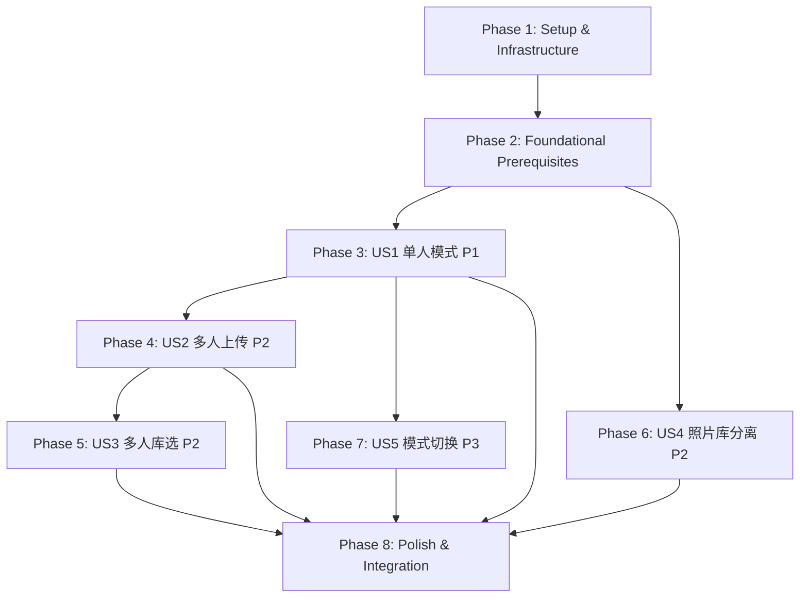

# Implementation Tasks: 多人照片生成模式选择

**功能分支**: `003-2`
**创建日期**: 2025-10-15
**预计开发周期**: 8-10个工作日
**状态**: Draft

---

## 概述

本任务清单为"多人照片生成模式选择"功能提供详细的实施步骤。功能核心目标:
- 支持单人/多人模式选择
- 多人模式需上传2-4张单人照,每张照片通过人脸检测验证
- 根据模式过滤风格列表
- 照片库分离:参考照片库 vs 生成照片相册

**优先级说明**:
- **P1 (高)**: US1单人照片生成流程 - MVP核心功能
- **P2 (中)**: US2/US3/US4多人生成和照片管理
- **P3 (低)**: US5模式切换优化

---

## Phase 1: Setup & Infrastructure (1天)

### T001: 初始化项目环境
- **文件**: 无需创建新文件
- **内容**:
  - 验证开发环境: Node.js >= 18, pnpm >= 9, Rust >= 1.75
  - 安装项目依赖: `pnpm install`
  - 验证Tauri开发服务器启动: `pnpm tauri dev`
  - 检查SQLite版本 >= 3.38 (支持JSON索引)
- **验收**:
  - Tauri窗口正常打开
  - 无依赖安装错误
  - 控制台无报错

### T002: 下载face-api.js模型文件
- **文件**: `public/face-models/`目录
- **内容**:
  - 下载TinyFaceDetector模型文件 (~1.2MB)
  - 下载FaceLandmark68Net模型文件 (~350KB)
  - 将模型文件保存到 `public/face-models/` 目录
  - 验证模型文件完整性
- **验收**:
  - `public/face-models/tiny_face_detector_model-shard1` 文件存在
  - `public/face-models/face_landmark_68_model-shard1` 文件存在
  - 文件大小正常(不为0)

### T003: 配置环境变量
- **文件**: `.env.local`
- **内容**:
  - 创建 `.env.local` 文件(如果不存在)
  - 添加 `SEEDREAM_API_KEY=your_api_key_here`
  - 添加 `SEEDREAM_API_URL=https://api.seed-byteplux.com`
  - 添加到 `.gitignore` 防止泄露
- **验收**:
  - `.env.local` 文件存在
  - API密钥可正常读取
  - 文件未提交到Git

---

## Phase 2: Foundational Prerequisites (1天)

### T004: [数据库] 执行Schema迁移(添加字段和索引)
- **文件**: `src/lib/database.ts`
- **内容**:
  - 在 `createTables()` 函数末尾添加 `migrateToV2()` 函数调用
  - `migrateToV2()` 执行以下SQL迁移:
    - `library_photos` 表添加字段: `face_count`, `face_confidence`, `quality_score`
    - `generation_tasks` 表添加字段: `mode` (默认'single')
    - `style_templates` 表添加字段: `supported_modes`, `min_photos`, `max_photos`, `is_multi_person`
  - 创建所有必需索引:
    - `idx_library_photos_ai_type_time` (照片类型+时间复合索引)
    - `idx_library_photos_face_count` (人脸数量索引)
    - `idx_library_photos_style` (JSON风格ID索引)
    - `idx_library_photos_milestone` (JSON里程碑索引)
    - `idx_library_photos_task` (JSON任务ID索引)
    - `idx_generation_tasks_mode` (任务模式索引)
  - 使用 `try-catch` 包裹每个ALTER TABLE,避免重复迁移错误
  - 添加迁移日志输出
- **验收**:
  - 重启应用后控制台显示 `[Migration] 迁移到v2.0完成`
  - 使用SQLite客户端验证所有字段和索引已创建
  - 现有数据不丢失,`is_ai_generated` 默认值为0

### T005: [类型定义] 创建核心类型定义文件
- **文件**: `src/lib/types.ts` (扩展现有类型)
- **内容**:
  - 添加 `GenerationMode` 类型: `'single' | 'multi'`
  - 添加 `GenerationModeConfig` 接口(模式配置)
  - 添加 `AIPhotoMetadata` 接口(AI元数据结构)
  - 添加 `FaceValidationResult` 接口(人脸检测结果)
  - 添加 `AlbumFilter` 接口(相册筛选条件)
  - 添加 `AlbumQueryResult` 接口(相册查询结果)
  - 扩展 `PhotoUpload` 接口,添加字段:
    - `isAIGenerated?: boolean`
    - `aiMetadata?: string`
    - `faceCount?: number`
    - `faceConfidence?: number`
    - `qualityScore?: number`
  - 扩展 `GenerationTask` 接口,添加 `mode: GenerationMode`
  - 扩展 `StyleTemplate` 接口,添加字段:
    - `supportedModes: GenerationMode[]`
    - `minPhotos: number`
    - `maxPhotos: number`
    - `isMultiPerson: boolean`
- **验收**:
  - TypeScript编译无错误
  - 所有新类型可以正常导入和使用
  - IDE自动补全和类型检查正常

### T006: [状态管理] 扩展Zustand store基础结构
- **文件**: `src/lib/store.ts`
- **内容**:
  - 扩展 `AppStore` 接口,添加新状态:
    - `generationMode: GenerationMode` (默认'single')
    - `photoValidationResults: Map<string, FaceValidationResult>`
    - `filteredStyleIds: string[]`
  - 添加模式管理方法:
    - `setGenerationMode(mode: GenerationMode): void`
    - `switchMode(newMode: GenerationMode): void` - 切换模式并清空照片
  - 添加照片管理方法:
    - `addPhoto(photo: PhotoUpload): Promise<void>` - 带验证的照片添加
    - `removePhoto(photoId: string): void`
    - `clearPhotos(): void`
  - 添加验证管理方法:
    - `setPhotoValidation(photoId: string, result: FaceValidationResult): void`
    - `getPhotoValidation(photoId: string): FaceValidationResult | undefined`
  - 添加风格过滤方法:
    - `updateFilteredStyles(): Promise<void>` - 根据模式过滤风格
  - 实现 `switchMode()` 逻辑:
    - 清空 `uploadedPhotos` 数组
    - 清空 `photoValidationResults` Map
    - 调用 `updateFilteredStyles()` 重新过滤风格
  - 暂时将 `updateFilteredStyles()` 实现为空函数(返回空数组),Phase 3中完善
- **验收**:
  - Store初始化成功,`generationMode` 默认为'single'
  - 调用 `switchMode()` 后状态正确清空
  - 类型定义完整,无TypeScript错误

---

## Phase 3: User Story 1 - 单人照片生成流程 (P1, 2天)

**Story Goal**: 用户可以选择单人模式,上传1张照片,选择单人风格,生成多张艺术照

**Independent Test**: 完整走通单人生成流程:选择单人模式→上传照片→选择风格→生成成功

### T007: [US1][Config] 创建生成模式配置模块
- **文件**: `src/lib/generationMode.ts` (新建)
- **内容**:
  - 定义 `GENERATION_MODES` 常量对象:
    - `single` 配置: displayName='单人照片', minPhotos=1, maxPhotos=1, requiresFaceDetection=false
    - `multi` 配置: displayName='多人照片', minPhotos=2, maxPhotos=4, requiresFaceDetection=true
  - 实现 `getGenerationModeConfig(mode: GenerationMode): GenerationModeConfig` 函数
  - 实现 `validatePhotoCount(mode: GenerationMode, photoCount: number): { isValid: boolean, error?: string }` 函数
  - 实现 `filterStylesByMode(mode: GenerationMode): Promise<string[]>` 函数
    - 查询所有风格模板
    - 根据 `supported_modes` JSON字段过滤
    - 返回支持该模式的风格ID数组
- **验收**:
  - `getGenerationModeConfig('single')` 返回正确配置
  - `validatePhotoCount('single', 2)` 返回 `{ isValid: false, error: '单人模式只能上传1张照片' }`
  - `filterStylesByMode('single')` 返回所有支持单人模式的风格ID

### T008: [US1][UI] 创建模式选择页面
- **文件**: `src/app/generation/mode/page.tsx` (新建)
- **内容**:
  - 创建模式选择页面组件 `ModeSelectionPage`
  - 使用 `useAppStore` 获取当前模式和切换方法
  - 渲染两个模式卡片(单人/多人):
    - 单人卡片: 图标👶, 标题"单人照片", 说明"上传1张照片,生成多种风格的个人写真"
    - 多人卡片: 图标👨‍👩‍👧, 标题"多人照片", 说明"上传2-4张单人照,生成温馨全家福"
  - 点击卡片时调用 `switchMode(mode)` 切换模式
  - 切换后跳转到照片上传页面: `router.push('/upload')`
  - 添加返回按钮返回上一页
  - 样式:选中模式卡片高亮显示(border-blue-500)
- **验收**:
  - 页面正常渲染两个模式卡片
  - 点击卡片能切换模式(store状态更新)
  - 切换后自动跳转到上传页面
  - 返回按钮正常工作

### T009: [US1][Service] 更新风格配置添加多人标识
- **文件**: `src/config/styles.ts` (修改现有文件)
- **内容**:
  - 为现有6个风格添加 `supportedModes` 字段:
    - `style_warm_home`: `supportedModes: ['single']`
    - `style_fresh_nature`: `supportedModes: ['single']`
    - `style_cartoon`: `supportedModes: ['single']`
    - `style_vintage`: `supportedModes: ['single']`
    - `style_dreamy`: `supportedModes: ['single']`
    - `style_festival`: `supportedModes: ['single']`
  - 添加 `minPhotos: 1`, `maxPhotos: 1`, `isMultiPerson: false`
  - (可选)未来添加多人风格时,设置 `supportedModes: ['multi']`, `minPhotos: 2`, `maxPhotos: 4`, `isMultiPerson: true`
- **验收**:
  - 所有现有风格配置包含新字段
  - `filterStylesByMode('single')` 返回6个风格ID
  - `filterStylesByMode('multi')` 返回空数组(暂无多人风格)

### T010: [US1][Service] 修改风格服务支持模式过滤
- **文件**: `src/lib/styleService.ts` (修改现有文件)
- **内容**:
  - 在 `findAllStyles()` 或相关查询函数中,添加模式过滤逻辑
  - 实现 `filterStylesByMode(mode: GenerationMode): Promise<StyleTemplate[]>` 函数:
    - 查询所有风格模板
    - 过滤 `supportedModes` 包含指定模式的风格
    - 返回过滤后的风格列表
  - 确保风格查询时读取新字段(`supportedModes`, `minPhotos`, `maxPhotos`)
- **验收**:
  - `filterStylesByMode('single')` 返回所有单人风格
  - `filterStylesByMode('multi')` 返回空数组或多人风格(如果已添加)
  - 风格对象包含 `supportedModes` 等新字段

### T011: [US1][UI] 修改风格选择页面添加模式过滤
- **文件**: `src/app/generation/style/page.tsx` (修改现有文件)
- **内容**:
  - 使用 `useAppStore` 获取当前 `generationMode`
  - 在页面顶部显示当前模式提示: "当前模式: 单人照片"
  - 调用 `filterStylesByMode(generationMode)` 获取可用风格
  - 只渲染支持当前模式的风格卡片
  - 如果无可用风格,显示提示: "暂无适用于XX模式的风格"
  - 保留原有风格选择逻辑(多选/单选)
- **验收**:
  - 单人模式下只显示单人风格(6个)
  - 多人模式下显示多人风格或提示无风格
  - 模式提示正确显示
  - 风格选择功能正常工作

### T012: [US1][Integration] 测试单人模式端到端流程
- **文件**: 无需新建文件(集成测试)
- **内容**:
  - 手动测试完整流程:
    1. 打开应用,进入模式选择页面
    2. 选择"单人照片"模式
    3. 跳转到照片上传页面,上传1张照片
    4. 跳转到风格选择页面,验证只显示单人风格
    5. 选择风格(如"居家暖光温馨风")
    6. 点击生成,验证任务创建成功
    7. 验证生成的照片保存到数据库,`mode='single'`
  - 记录测试结果和遇到的问题
  - 修复发现的Bug
- **验收**:
  - 完整流程无报错
  - 生成任务状态正常
  - 照片成功保存到生成照片相册
  - 数据库 `generation_tasks.mode='single'`

**Checkpoint**: US1完成后应可独立交付,用户能够使用单人模式生成照片

---

## Phase 4: User Story 2 - 多人照片生成(上传模式) (P2, 2天)

**Story Goal**: 用户可以选择多人模式,上传2-4张单人照,系统验证后生成全家福

**Independent Test**: 完整走通多人上传流程:选择多人模式→上传3张单人照→验证通过→选择多人风格→生成全家福

### T013: [US2][Service] 实现face-api.js人脸检测服务
- **文件**: `src/lib/faceDetection.ts` (新建)
- **内容**:
  - 导入 `face-api.js` 库
  - 实现 `loadFaceDetectionModels(): Promise<void>` 函数:
    - 从 `/face-models` 路径加载模型
    - 加载 `tinyFaceDetector` 和 `faceLandmark68Net`
    - 设置模型加载标志,避免重复加载
    - 添加错误处理和日志输出
  - 实现 `validateSinglePersonPhoto(filePath: string): Promise<FaceValidationResult>` 函数:
    - 使用 `@tauri-apps/api/core` 的 `convertFileSrc()` 转换文件路径
    - 加载图片元素
    - 调用 `faceapi.detectAllFaces()` 检测人脸
    - 检测配置: `inputSize: 512, scoreThreshold: 0.5`
    - 验证人脸数量:
      - faceCount=0: 返回 `{ isValid: false, error: '未检测到人脸' }`
      - faceCount>1: 返回 `{ isValid: false, error: '检测到X人' }`
      - faceCount=1: 返回 `{ isValid: true, faceCount: 1, confidence: score }`
    - 添加timestamp字段
  - 实现辅助函数 `loadImage(src: string): Promise<HTMLImageElement>`
  - 添加超时控制(10秒)
  - 添加错误处理(文件不存在/格式错误/检测失败)
- **验收**:
  - 模型加载成功,无报错
  - `validateSinglePersonPhoto()` 能正确检测单人照
  - 多人照返回 `isValid: false`
  - 无人脸照片返回 `isValid: false`
  - 检测时间 < 2秒

### T014: [US2][UI] 修改照片上传页面添加人脸检测
- **文件**: `src/app/upload/page.tsx` (修改现有文件)
- **内容**:
  - 导入 `validateSinglePersonPhoto` 函数
  - 使用 `useAppStore` 获取 `generationMode`
  - 在页面顶部显示当前模式提示和照片数量要求
  - 修改 `handleFileSelect` 函数:
    - 检查照片数量限制(单人1张,多人2-4张)
    - 对于多人模式,逐张照片调用人脸检测
    - 显示检测进度提示: "正在检测人脸,请稍候..."
    - 检测失败时显示错误提示,阻止照片添加
    - 检测成功时:
      - 调用 `setPhotoValidation()` 保存验证结果
      - 调用 `addPhoto()` 添加照片到状态
      - 更新照片的 `faceCount` 和 `faceConfidence` 字段
  - 单人模式跳过人脸检测,直接添加照片
  - 添加验证状态UI:
    - 检测中: 蓝色提示框 "正在检测人脸,请稍候..."
    - 检测失败: 红色提示框显示错误消息
  - 已上传照片列表显示人脸检测结果(多人模式):
    - 绿色勾选标记表示验证通过
    - 红色叉号表示验证失败
- **验收**:
  - 单人模式上传照片无人脸检测,直接添加
  - 多人模式上传照片触发人脸检测
  - 检测失败时显示错误提示,照片不添加
  - 检测成功时照片正常添加,状态更新
  - 检测进度提示正常显示

### T015: [US2][Component] 在应用启动时加载人脸检测模型
- **文件**: `src/app/layout.tsx` (修改现有文件)
- **内容**:
  - 导入 `loadFaceDetectionModels` 函数
  - 在 `useEffect` 中调用 `loadFaceDetectionModels()`
  - 添加错误处理:如果模型加载失败,显示用户提示
  - 添加加载状态管理(可选):显示"正在加载人脸检测模型..."
  - 确保模型只加载一次(使用状态标志)
- **验收**:
  - 应用启动时自动加载模型
  - 控制台显示 `[FaceDetection] ✓ 模型加载完成`
  - 模型加载失败时有错误提示
  - 后续照片上传不再重复加载模型

### T016: [US2][Service] 修改任务服务支持多人模式
- **文件**: `src/lib/taskService.ts` 或生成任务相关文件 (修改现有文件)
- **内容**:
  - 修改 `createGenerationTask()` 函数:
    - 从 `useAppStore` 获取 `generationMode`
    - 将 `mode` 字段添加到任务记录
    - 保存 `photoIds` 数组(单人1个ID,多人2-4个ID)
  - 修改任务数据库插入SQL:
    - 添加 `mode` 字段到INSERT语句
    - 验证 `photoIds` 数组长度符合模式要求
  - 修改任务查询函数,确保返回 `mode` 字段
- **验收**:
  - 创建单人任务时 `mode='single'`, `photoIds` 长度为1
  - 创建多人任务时 `mode='multi'`, `photoIds` 长度为2-4
  - 数据库 `generation_tasks` 表包含 `mode` 字段
  - 查询任务时正确返回 `mode` 值

### T017: [US2][Backend] 修改Seedream API支持多图数组
- **文件**:
  - `src-tauri/src/lib.rs` (Rust后端)
  - `src/lib/imageGenerators/seedream.ts` (TypeScript前端调用)
- **内容**:
  - **Rust后端** (`src-tauri/src/lib.rs` 或 `src-tauri/src/seedream.rs`):
    - 修改 `SeedreamGeneratePayload` 结构体:
      - 将 `image_base64` 字段类型从 `String` 改为 `Vec<String>` 或 `serde_json::Value`
      - 支持接收单个字符串或字符串数组
    - 修改 `seedream_generate` Tauri命令:
      - 根据 `image_base64` 类型判断单人/多人模式
      - 构建HTTP请求体,传递多图数组给Seedream API
      - 处理API响应,返回生成的图片数组
    - 添加日志输出调试信息
  - **TypeScript前端** (`src/lib/imageGenerators/seedream.ts`):
    - 修改 `SeedreamGeneratePayload` 接口:
      - `image_base64: string | string[]`
    - 实现 `generateWithSeedream(photos: PhotoUpload[], mode: GenerationMode, prompt: string): Promise<string[]>` 函数:
      - 将照片文件路径转换为base64数组
      - 根据模式组装payload: 单人传字符串,多人传数组
      - 调用 `invoke('seedream_generate', { payload })`
      - 返回生成的图片base64数组
    - 实现 `convertPhotoToBase64(filePath: string): Promise<string>` 辅助函数
  - **备用方案**(如果Seedream不支持数组):
    - 实现图像拼接函数 `mergePhotosToSingle(photos: PhotoUpload[]): Promise<string>`
    - 使用Canvas将多张照片横向拼接为单张图
    - 传递拼接后的base64给API
- **验收**:
  - 单人模式调用API传递单个base64字符串
  - 多人模式调用API传递base64数组(或拼接后的单张图)
  - API调用成功返回生成图片
  - Rust后端日志正确显示请求参数

### T018: [US2][Integration] 测试多人上传模式端到端流程
- **文件**: 无需新建文件(集成测试)
- **内容**:
  - 手动测试完整流程:
    1. 选择"多人照片"模式
    2. 上传3张单人照(宝宝、爸爸、妈妈)
    3. 验证每张照片触发人脸检测
    4. 验证所有照片通过检测(faceCount=1)
    5. 进入风格选择页面,验证只显示多人风格(如果已添加)
    6. 选择多人风格并生成
    7. 验证生成的照片包含3个人的特征
    8. 验证数据库任务记录: `mode='multi'`, `photoIds` 长度为3
    9. 验证AI照片元数据包含3个 `sourcePhotoIds`
  - 测试异常场景:
    - 上传多人照片(faceCount>1),验证被拒绝
    - 上传无人脸照片(faceCount=0),验证被拒绝
    - 上传超过4张照片,验证被阻止
  - 记录测试结果和Bug
- **验收**:
  - 完整流程无报错
  - 人脸检测正确拦截不合格照片
  - 多人生成任务创建成功
  - 生成照片元数据包含所有源照片ID
  - 异常场景错误提示正确

**Checkpoint**: US2完成后支持多人上传生成,US1功能不受影响

---

## Phase 5: User Story 3 - 多人照片生成(照片库选择) (P2, 1天)

**Story Goal**: 用户可以选择多人模式,从照片库勾选2-4张已有单人照,生成全家福

**Independent Test**: 完整走通照片库选择流程:选择多人模式→从照片库勾选3张单人照→验证通过→选择多人风格→生成全家福

### T019: [US3][Service] 实现参考照片库查询服务
- **文件**: `src/lib/photoLibrary.ts` (新建或修改现有文件)
- **内容**:
  - 实现 `getReferencePhotos(personId?: string): Promise<PhotoUpload[]>` 函数:
    - 查询 `library_photos` 表,条件 `is_ai_generated = 0`
    - 可选按 `person_id` 筛选
    - 按 `uploaded_at DESC` 排序
    - 返回参考照片列表
  - 实现 `mapToPhotoUpload(rows: any[]): PhotoUpload[]` 辅助函数:
    - 将数据库行映射为 `PhotoUpload` 对象
    - 解析JSON字段(如 `aiMetadata`)
  - 确保查询使用索引 `idx_library_photos_ai_type_time`
  - 添加错误处理和日志
- **验收**:
  - `getReferencePhotos()` 返回所有用户上传的照片
  - `getReferencePhotos('person_baby_001')` 只返回宝宝的照片
  - 返回结果不包含AI生成照片(is_ai_generated=1)
  - 查询性能 < 10ms (100张照片)

### T020: [US3][UI] 创建照片库选择组件
- **文件**: `src/components/PhotoLibrarySelector.tsx` (新建)
- **内容**:
  - 创建 `PhotoLibrarySelector` 组件
  - Props: `maxSelect: number`, `onSelect: (photoIds: string[]) => void`
  - 使用 `useState` 管理选中照片ID集合
  - 调用 `getReferencePhotos()` 加载照片列表
  - 渲染照片网格:
    - 每张照片显示缩略图
    - 支持多选(复选框)
    - 显示选中状态(边框高亮)
  - 限制选中数量:
    - 达到 `maxSelect` 时禁用未选中照片
    - 提示"已选择X/Y张照片"
  - 确认按钮:点击后调用 `onSelect(selectedIds)` 回调
  - 取消按钮:清空选择并关闭
  - 只显示参考照片库(不显示AI生成照片)
- **验收**:
  - 组件正常渲染照片网格
  - 多选功能正常工作
  - 选中数量限制生效
  - 确认后回调函数接收正确的照片ID数组
  - 只显示用户上传照片,不显示AI照片

### T021: [US3][UI] 修改照片上传页面添加"从照片库选择"入口
- **文件**: `src/app/upload/page.tsx` (修改现有文件)
- **内容**:
  - 添加"从照片库选择"按钮,点击打开 `PhotoLibrarySelector` 弹窗
  - 根据 `generationMode` 设置 `maxSelect`:
    - 单人模式: `maxSelect=1`
    - 多人模式: `maxSelect=4`
  - 实现 `handleLibrarySelect(photoIds: string[])` 回调:
    - 根据ID数组查询照片详情
    - 对于多人模式,验证每张照片的 `faceCount` 是否为1
    - 验证失败时显示错误提示,高亮问题照片
    - 验证成功时将照片添加到 `uploadedPhotos` 状态
  - 更新UI:
    - 显示"上传照片"和"从照片库选择"两个选项
    - 两个选项互不冲突,可以混合使用(先上传后从库选,或反之)
  - 已选照片列表合并显示上传和库选照片
- **验收**:
  - "从照片库选择"按钮正常显示
  - 点击打开照片库选择弹窗
  - 选择照片后正确添加到状态
  - 多人模式验证 `faceCount=1`
  - 选择数量限制生效
  - 上传和库选照片可以混合使用

### T022: [US3][Integration] 测试照片库选择模式端到端流程
- **文件**: 无需新建文件(集成测试)
- **内容**:
  - 前置条件:先上传至少3张单人照到照片库
  - 手动测试完整流程:
    1. 选择"多人照片"模式
    2. 点击"从照片库选择"
    3. 勾选3张已有单人照
    4. 点击"确认选择"
    5. 验证照片添加到上传列表
    6. 验证人脸检测结果(应使用数据库存储的 `faceCount`)
    7. 进入风格选择页面
    8. 选择多人风格并生成
    9. 验证生成成功,照片元数据正确
  - 测试异常场景:
    - 选择的照片中包含多人照(faceCount>1),验证被拒绝
    - 选择超过4张照片,验证被阻止
  - 记录测试结果
- **验收**:
  - 完整流程无报错
  - 从照片库选择的照片能正常生成
  - 异常场景错误提示正确
  - 生成照片元数据包含正确的 `sourcePhotoIds`

**Checkpoint**: US3完成后支持照片库选择,提升多人模式用户体验

---

## Phase 6: User Story 4 - 照片库分离管理 (P2, 1.5天)

**Story Goal**: 将用户上传的参考照片库和AI生成的照片相册分开管理,支持多维度筛选

**Independent Test**: 上传照片→生成AI照片→在参考照片库中只看到上传照片→在生成照片相册中看到AI照片并可筛选

### T023: [US4][Service] 实现AI照片保存服务
- **文件**: `src/lib/photoLibrary.ts` (扩展现有文件)
- **内容**:
  - 实现 `insertAIGeneratedPhoto(photo: Omit<PhotoUpload, 'id'>, metadata: AIPhotoMetadata): Promise<PhotoUpload>` 函数:
    - 验证 `isAIGenerated` 必须为 `true`
    - 验证元数据完整性(taskId, styleId, sourcePhotoIds必填)
    - 验证生成模式与照片数量一致:
      - `generationMode='single'` 且 `sourcePhotoIds.length=1`
      - `generationMode='multi'` 且 `2 <= sourcePhotoIds.length <= 4`
    - 序列化 `metadata` 为JSON字符串
    - 插入 `library_photos` 表,设置 `is_ai_generated=1`
    - 返回插入后的照片对象
  - 实现 `updatePhotoMetadata(photoId: string, metadata: Partial<AIPhotoMetadata>): Promise<void>` 函数
  - 添加数据验证和错误处理
- **验收**:
  - 成功插入AI照片, `is_ai_generated=1`
  - `aiMetadata` JSON格式正确
  - 元数据验证逻辑生效,不合法数据被拒绝
  - 查询 `library_photos` 可以看到AI照片和参考照片分离

### T024: [US4][Service] 实现生成照片相册查询服务
- **文件**: `src/lib/photoLibrary.ts` (扩展现有文件)
- **内容**:
  - 实现 `getGeneratedPhotos(filter: AlbumFilter): Promise<AlbumQueryResult>` 函数:
    - 根据 `filter.photoType` 筛选:
      - `'reference'`: `is_ai_generated = 0`
      - `'ai'`: `is_ai_generated = 1`
      - `'all'`: 不过滤
    - 支持AI照片专属筛选:
      - `filter.styleId`: 使用 `json_extract(ai_metadata, '$.styleId') = ?`
      - `filter.milestoneName`: 使用 `json_extract(ai_metadata, '$.milestoneName') = ?`
      - `filter.generationMode`: 使用 `json_extract(ai_metadata, '$.generationMode') = ?`
    - 支持通用筛选:
      - `filter.personId`: `person_id = ?`
      - `filter.dateRange`: `uploaded_at BETWEEN ? AND ?`
    - 支持分页: `LIMIT` 和 `OFFSET`
    - 查询总数: `SELECT COUNT(*)`
    - 按 `uploaded_at DESC` 排序
    - 返回 `{ photos, total, hasMore }`
  - 确保查询使用索引:
    - `idx_library_photos_ai_type_time`
    - `idx_library_photos_style`
    - `idx_library_photos_milestone`
  - 添加参数化查询防止SQL注入
- **验收**:
  - `getGeneratedPhotos({ photoType: 'ai' })` 只返回AI照片
  - `getGeneratedPhotos({ photoType: 'reference' })` 只返回参考照片
  - 风格筛选正确: `styleId='style_warm_home'` 只返回该风格照片
  - 日期范围筛选正确
  - 分页功能正常, `hasMore` 标志正确
  - 查询性能 < 50ms (1000张照片,单条件筛选)

### T025: [US4][Service] 实现源照片溯源查询
- **文件**: `src/lib/photoLibrary.ts` (扩展现有文件)
- **内容**:
  - 实现 `getSourcePhotos(generatedPhotoId: string): Promise<PhotoUpload[]>` 函数:
    - 根据ID查询生成照片
    - 解析 `aiMetadata` JSON获取 `sourcePhotoIds` 数组
    - 使用 `IN` 查询批量获取源照片详情
    - 返回源照片列表
  - 实现 `getPhotoById(photoId: string): Promise<PhotoUpload | null>` 辅助函数
  - 添加错误处理:照片不存在/不是AI照片/元数据缺失
- **验收**:
  - 单人照片生成场景: `getSourcePhotos()` 返回1张源照片
  - 多人照片生成场景: `getSourcePhotos()` 返回2-4张源照片
  - 源照片顺序与 `sourcePhotoIds` 数组一致
  - 查询性能 < 5ms (4张照片)

### T026: [US4][UI] 创建生成照片相册页面
- **文件**: `src/app/album/page.tsx` (新建或修改现有相册页面)
- **内容**:
  - 创建相册页面组件 `GeneratedPhotoAlbumPage`
  - 实现筛选器组件 `AlbumFilterBar`:
    - 照片类型选择: "全部" / "用户上传" / "AI生成"
    - 日期范围选择: "全部" / "最近7天" / "最近30天" / "自定义"
    - 里程碑选择: 下拉菜单(百日照/周岁照/...)
    - 风格选择: 下拉菜单(居家暖光/森系清新/...)
    - 生成模式选择: "全部" / "单人" / "多人"
    - 清空筛选按钮
  - 使用 `useState` 管理筛选条件 `filter: AlbumFilter`
  - 使用 `useEffect` 监听 `filter` 变化,调用 `getGeneratedPhotos(filter)`
  - 渲染照片网格:
    - 显示照片缩略图
    - 显示照片元数据标签(风格、里程碑、日期)
    - 点击照片放大预览
    - 点击"查看源照片"按钮,调用 `getSourcePhotos()` 显示源照片
  - 实现虚拟滚动(使用 `react-window`,可选优化):
    - 每次加载50张照片
    - 滚动到底部自动加载更多
  - 显示筛选结果统计: "共X张照片"
  - 无结果时显示提示: "暂无符合条件的照片"
- **验收**:
  - 筛选器UI正常渲染
  - 选择筛选条件后照片列表正确更新
  - 照片类型筛选正确分离参考照片和AI照片
  - 组合筛选正确(如"百日照+森系清新风+最近7天")
  - 点击"查看源照片"正确显示源照片列表
  - 分页加载正常工作

### T027: [US4][Integration] 测试照片分离和筛选功能
- **文件**: 无需新建文件(集成测试)
- **内容**:
  - 前置条件:
    - 上传5张参考照片
    - 生成10张AI照片(不同风格、里程碑)
  - 测试照片分离:
    1. 打开相册页面,筛选"用户上传"
    2. 验证只显示5张参考照片
    3. 筛选"AI生成"
    4. 验证只显示10张AI照片
  - 测试单条件筛选:
    1. 筛选风格"居家暖光温馨风"
    2. 验证只显示该风格照片
    3. 筛选日期"最近7天"
    4. 验证只显示7天内照片
  - 测试组合筛选:
    1. 同时选择"百日照"+"森系清新风"+"最近7天"
    2. 验证返回结果同时满足所有条件
  - 测试源照片溯源:
    1. 点击一张多人生成照片
    2. 点击"查看源照片"
    3. 验证显示3张源照片(宝宝+爸爸+妈妈)
  - 测试性能:
    1. 筛选查询响应时间 < 100ms (1000张照片)
  - 记录测试结果
- **验收**:
  - 照片分离100%准确,无混合
  - 所有筛选条件工作正常
  - 组合筛选结果正确
  - 源照片溯源准确
  - 查询性能达标

**Checkpoint**: US4完成后照片管理体验显著提升,参考库和相册完全分离

---

## Phase 7: User Story 5 - 模式切换 (P3, 0.5天)

**Story Goal**: 用户可以在流程中途切换模式,系统清空照片并重新开始

**Independent Test**: 选择单人模式→上传照片→返回切换到多人模式→照片被清空→重新上传多张照片

### T028: [US5][UI] 添加模式切换确认弹窗
- **文件**: `src/app/generation/mode/page.tsx` (修改现有文件)
- **内容**:
  - 修改 `handleModeSelect()` 函数:
    - 检查 `uploadedPhotos.length > 0`
    - 如果已有照片,显示确认弹窗: "切换模式将清空已选照片,确认继续吗?"
    - 用户确认后调用 `switchMode()`
    - 用户取消则不切换
  - 如果没有照片,直接切换无需确认
  - 弹窗样式:使用 `confirm()` 或自定义Modal组件
- **验收**:
  - 已选照片时切换模式显示确认弹窗
  - 确认后模式切换,照片清空
  - 取消后保持原模式,照片不变
  - 未选照片时直接切换,无弹窗

### T029: [US5][UI] 添加返回按钮支持重新选择照片
- **文件**:
  - `src/app/generation/style/page.tsx` (风格选择页面)
  - 其他相关页面
- **内容**:
  - 在风格选择页面添加"返回"按钮
  - 点击返回按钮:
    - 跳转回照片上传页面
    - 保持当前模式不变
    - 保持已选照片不变(允许修改照片)
  - 在其他页面也添加返回按钮(如照片上传页面返回模式选择)
  - 确保返回逻辑不清空状态
- **验收**:
  - 风格选择页面点击返回跳转到照片上传页面
  - 返回后模式和照片状态保持不变
  - 用户可以修改照片(删除/添加)
  - 再次进入风格选择页面状态一致

### T030: [US5][Integration] 测试模式切换流程
- **文件**: 无需新建文件(集成测试)
- **内容**:
  - 测试场景1:中途切换模式
    1. 选择单人模式,上传1张照片
    2. 返回模式选择页面
    3. 点击切换到多人模式
    4. 确认弹窗点击"确认"
    5. 验证照片被清空
    6. 重新上传3张照片
    7. 完成生成
  - 测试场景2:取消切换
    1. 选择单人模式,上传1张照片
    2. 返回模式选择页面
    3. 点击切换到多人模式
    4. 确认弹窗点击"取消"
    5. 验证保持单人模式,照片未清空
  - 测试场景3:返回修改照片
    1. 选择多人模式,上传3张照片
    2. 进入风格选择页面
    3. 点击返回
    4. 删除1张照片,重新上传另一张
    5. 再次进入风格选择页面
    6. 验证照片列表已更新
  - 记录测试结果
- **验收**:
  - 模式切换流程正常,照片清空逻辑正确
  - 确认/取消弹窗功能正常
  - 返回修改照片功能正常
  - 无状态异常或数据丢失

**Checkpoint**: US5完成后用户体验更灵活,允许中途改变决策

---

## Phase 8: Polish & Integration (1天)

### T031: [集成测试] 完整端到端测试(所有User Stories)
- **文件**: 无需新建文件
- **内容**:
  - 测试US1单人模式完整流程(至少3次)
  - 测试US2多人上传模式完整流程(至少3次)
  - 测试US3多人库选模式完整流程(至少3次)
  - 测试US4照片分离和筛选(至少5个筛选组合)
  - 测试US5模式切换(至少2个场景)
  - 测试所有Edge Cases(参考spec.md):
    - 照片数量限制
    - 人脸检测失败
    - 多人照片误上传
    - 照片质量过低
    - 风格兼容性
    - 网络中断恢复
    - 混合模式禁止
  - 记录所有发现的Bug和问题
  - 编写测试报告
- **验收**:
  - 所有User Story完整流程通过
  - 所有Edge Cases正确处理
  - Bug列表已记录
  - 测试报告已提交

### T032: [性能优化] 查询性能优化和监控
- **文件**: `src/lib/photoLibrary.ts` (添加性能监控)
- **内容**:
  - 添加查询性能监控装饰器或日志:
    - 记录每次查询的耗时
    - 如果查询 > 200ms,输出警告日志
  - 验证所有索引是否生效:
    - 使用 `EXPLAIN QUERY PLAN` 检查关键查询
    - 确保使用了正确的索引
  - 优化慢查询(如果存在):
    - 考虑添加新索引
    - 优化SQL语句
  - (可选)实现缩略图生成:
    - 上传/生成照片时自动生成200x200缩略图
    - 添加 `thumbnail_path` 字段
    - 相册列表使用缩略图加载
  - (可选)实现虚拟滚动:
    - 在相册页面使用 `react-window`
    - 只渲染可见区域照片
- **验收**:
  - 所有关键查询使用索引
  - 查询性能达标(参考data-model.md性能目标)
  - 慢查询已优化或有优化计划
  - 性能监控日志正常工作

### T033: [错误处理] 完善错误处理和用户提示
- **文件**: 所有相关文件
- **内容**:
  - 统一错误消息格式和样式
  - 完善所有API调用的错误处理:
    - 数据库查询失败
    - 人脸检测失败
    - Seedream API调用失败
    - 文件读写失败
  - 添加用户友好的错误提示:
    - 使用Toast通知或Alert组件
    - 错误消息清晰说明原因和解决方案
    - 提供重试按钮(如果适用)
  - 添加全局错误边界(Error Boundary):
    - 捕获React组件错误
    - 显示友好的错误页面
    - 提供返回首页按钮
  - 添加网络状态检测:
    - 检测网络断开
    - 显示离线提示
    - 网络恢复后自动重试
  - 完善日志系统:
    - 记录所有错误到控制台
    - (可选)记录到本地文件
- **验收**:
  - 所有错误场景有友好提示
  - 用户能够理解错误原因
  - 错误提示样式统一美观
  - 全局错误边界正常工作
  - 网络中断场景正确处理

### T034: [文档] 更新开发文档和注释
- **文件**:
  - `README.md`
  - `src/lib/*.ts` (代码注释)
  - `specs/003-2/README.md` (可选)
- **内容**:
  - 更新项目README:
    - 添加多人照片生成功能说明
    - 更新功能列表
    - 添加使用截图或GIF演示
  - 完善代码注释:
    - 所有公共API添加JSDoc注释(中文)
    - 复杂逻辑添加行内注释解释
    - 类型定义添加说明
  - 更新API文档(如果有):
    - 同步最新的函数签名
    - 添加示例代码
  - 编写功能使用指南(可选):
    - 如何使用单人模式
    - 如何使用多人模式
    - 如何管理照片库
  - 添加Changelog条目:
    - 记录本次功能发布的变更
- **验收**:
  - README已更新,内容准确
  - 代码注释完整,中文书写
  - API文档与实现一致
  - Changelog条目已添加

### T035: [UI/UX] 界面优化和交互改进
- **文件**: 所有UI组件文件
- **内容**:
  - 统一UI样式和颜色方案
  - 优化按钮、卡片、表单等组件样式
  - 添加加载状态指示器:
    - 人脸检测中显示Spinner
    - API调用中显示Loading
    - 照片上传中显示进度条
  - 添加动画效果(可选):
    - 页面切换过渡动画
    - 照片添加/删除动画
    - 弹窗显示/隐藏动画
  - 优化移动端适配:
    - 响应式布局
    - 触摸友好的按钮大小
    - 移动端照片选择优化
  - 添加无障碍支持:
    - 添加ARIA标签
    - 键盘导航支持
    - 屏幕阅读器兼容
  - 用户引导优化:
    - 首次使用显示引导提示
    - 空状态占位图和引导文案
    - 操作提示和帮助文本
- **验收**:
  - UI样式统一美观
  - 加载状态正常显示
  - 移动端体验良好
  - 无障碍功能正常
  - 用户引导清晰有效

---

## Dependencies

### User Story Completion Order



### Task Dependencies (关键任务)

**阻塞性依赖** (必须按顺序):
- T001-T003 (Setup) → T004-T006 (Foundation) → 所有后续任务
- T004 (数据库迁移) → T023 (AI照片保存), T024 (相册查询)
- T005 (类型定义) → 所有使用类型的任务
- T006 (Zustand扩展) → T007-T012 (US1所有任务)
- T007 (模式配置) → T008 (模式选择UI), T009 (风格配置)
- T013 (人脸检测服务) → T014 (上传页面人脸检测), T015 (模型加载)
- T019 (参考照片库查询) → T020 (照片库选择组件)
- T023 (AI照片保存) → T024 (相册查询), T025 (源照片溯源)

**并行执行** (可同时开发):
- **US1 Phase**:
  - T007 (模式配置) + T009 (风格配置) 可并行
  - T010 (风格服务) + T011 (风格选择UI) 可并行(同一开发者先后完成)
- **US2 Phase**:
  - T013 (人脸检测服务) + T016 (任务服务) 可并行
  - T015 (模型加载) + T014 (上传页面) 可串行(T015依赖T013)
- **US4 Phase**:
  - T023 (AI照片保存) + T025 (源照片溯源) 可串行(T025依赖T023)
  - T024 (相册查询) + T026 (相册UI) 可串行(T026依赖T024)

---

## MVP Scope (首次可交付版本)

**包含Phase**:
- Phase 1: Setup & Infrastructure
- Phase 2: Foundational Prerequisites
- Phase 3: User Story 1 - 单人照片生成流程

**包含任务**: T001-T012 (共12个任务)

**预计开发时间**: 4个工作日

**MVP交付价值**:
- 用户可以选择单人模式生成照片
- 核心生成流程完整可用
- 数据库Schema已迁移,支持后续扩展
- 为多人模式打好基础

---

## Parallel Execution Plan

### Week 1 (Day 1-5)
**开发者A (后端+数据库)**:
- Day 1: T001-T003 (Setup) + T004 (数据库迁移)
- Day 2: T005 (类型定义) + T006 (Zustand扩展)
- Day 3: T007 (模式配置) + T013 (人脸检测服务)
- Day 4: T016 (任务服务) + T017 (Seedream API)
- Day 5: T019 (参考照片库查询) + T023 (AI照片保存)

**开发者B (前端UI)**:
- Day 1: 等待Setup完成
- Day 2: T008 (模式选择UI) + T009 (风格配置)
- Day 3: T010 (风格服务) + T011 (风格选择UI)
- Day 4: T014 (上传页面人脸检测) + T015 (模型加载)
- Day 5: T020 (照片库选择组件) + T021 (上传页面库选入口)

### Week 2 (Day 6-10)
**开发者A (后端+集成)**:
- Day 6: T024 (相册查询) + T025 (源照片溯源)
- Day 7: T012 (US1集成测试) + T018 (US2集成测试)
- Day 8: T022 (US3集成测试) + T027 (US4集成测试)
- Day 9: T031 (完整集成测试) + T032 (性能优化)
- Day 10: T033 (错误处理) + T034 (文档更新)

**开发者B (前端UI)**:
- Day 6: T026 (相册UI) + T028 (模式切换确认)
- Day 7: T029 (返回按钮) + T030 (模式切换测试)
- Day 8: 协助集成测试
- Day 9: T035 (UI/UX优化)
- Day 10: 协助文档和最终验收

---

## Summary

### 任务统计
- **总任务数**: 35个任务
- **MVP任务数** (US1): 12个任务
- **P1任务** (US1): 7个核心任务
- **P2任务** (US2+US3+US4): 20个任务
- **P3任务** (US5): 3个任务
- **集成与优化任务**: 5个任务

### 预计开发时间
- **MVP开发** (US1): 4个工作日
- **完整功能开发** (所有US): 10个工作日
- **单人开发**: 10个工作日
- **双人并行开发**: 6-7个工作日

### Critical Path (关键路径)
```
Setup (1天)
  → Foundation (1天)
  → US1 (2天)
  → US2 (2天)
  → US3 (1天)
  → US4 (1.5天)
  → US5 (0.5天)
  → Polish (1天)
```
**总关键路径时长**: 10个工作日

### 风险评估
- **高风险**: T017 (Seedream API多图支持) - 如果API不支持数组,需要实现图像拼接备用方案
- **中风险**: T013 (人脸检测) - 检测准确率可能不达预期,需要调整阈值
- **低风险**: T032 (性能优化) - 可能需要更多时间优化大数据量查询

### 成功标准
- 所有35个任务验收通过
- 5个User Story独立测试通过
- 性能指标达标(参考data-model.md)
- 无P0/P1级别Bug
- 代码审查通过
- 文档完整且准确

---

**文档版本**: v1.0
**最后更新**: 2025-10-15
**下一步**: 提交给开发团队评审,确认任务分解合理性后开始实施
